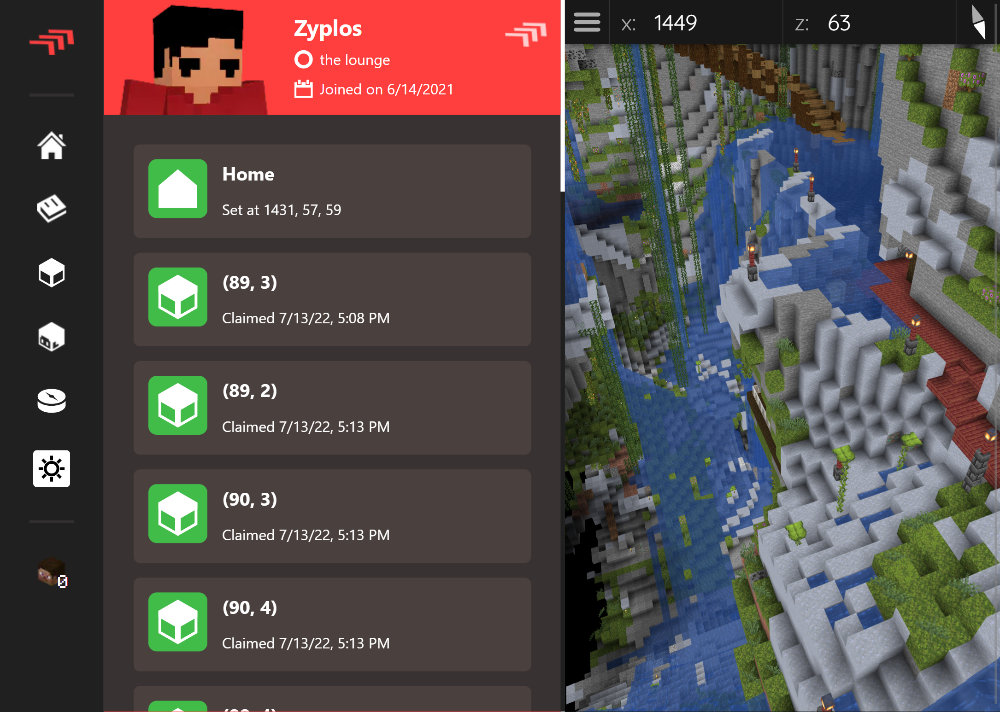

# lounge-hub

The lounge hub is a community website created to document some resources and showcase player profiles for people playing on the community's Minecraft server.

This project was built using Next.js. Authentication is handled by NextAuth to allow users to login using Discord. The frontend leverages [theme-ui](https://github.com/system-ui/theme-ui) to easily handle styles, themes, and component building.

Player profiles use [Bluemap](https://github.com/BlueMap-Minecraft/BlueMap) to visualize the Minecraft world in the browser. The map is updated when there are no players online.

General user profile data is stored in Firebase for easy access. Minecraft player data is stored in a MySQL database that is populated by players using the ingame plugin ([repo here](https://github.com/Zyplos/LoungeCommuna)).



## Project Setup

This project was made specifically for the lounge and as such has functionality that was made with this in mind. Setting up this project to work exactly as it does with the lounge will probably be a little difficult, but you are welcome to try.

This project expects a Firebase Realtime Database and a MySQL database to be configured and ready. The `.env` file contains some of the credentials and information the project needs to function.

This is a [Next.js](https://nextjs.org/) project bootstrapped with [`create-next-app`](https://github.com/vercel/next.js/tree/canary/packages/create-next-app).

Install the dependencies and run the development server with:

```bash
npm run dev
```

Open [http://localhost:3000](http://localhost:3000) with your browser to see the result.

You can start editing the page by modifying `app/page.tsx`. The page auto-updates as you edit the file.
